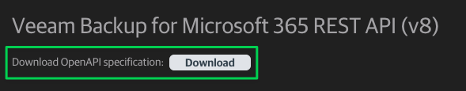
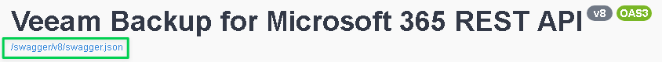
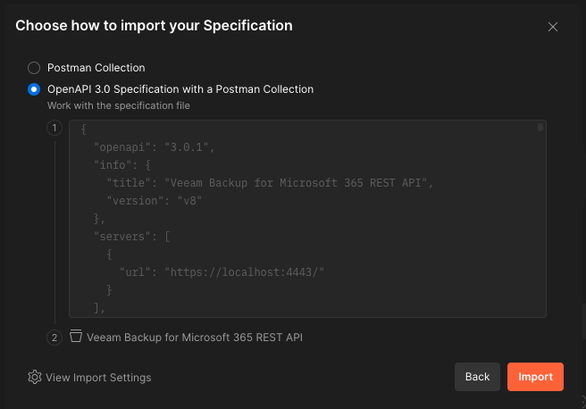
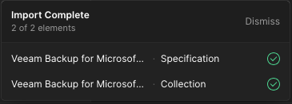
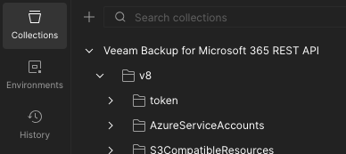
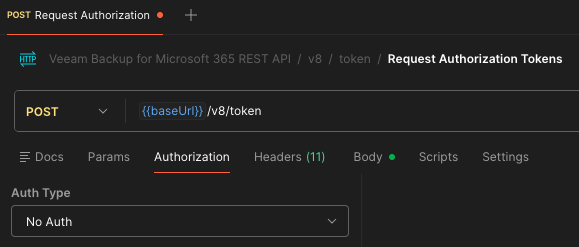
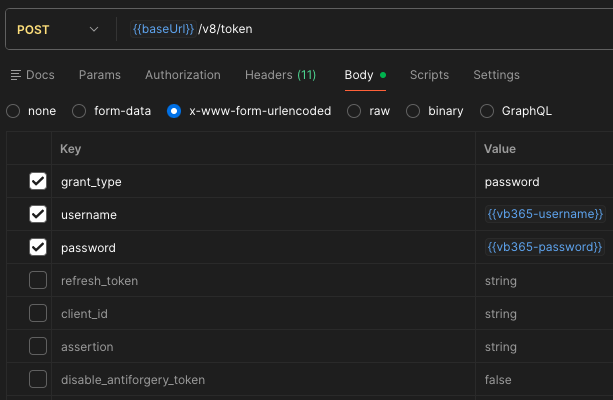
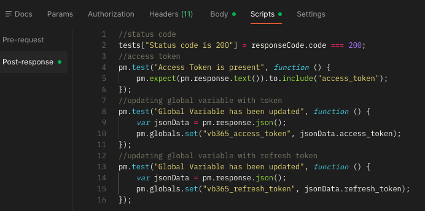
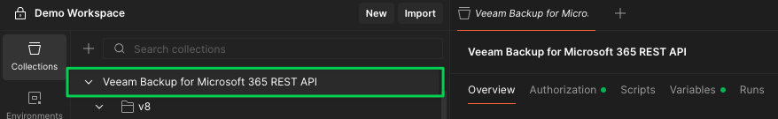
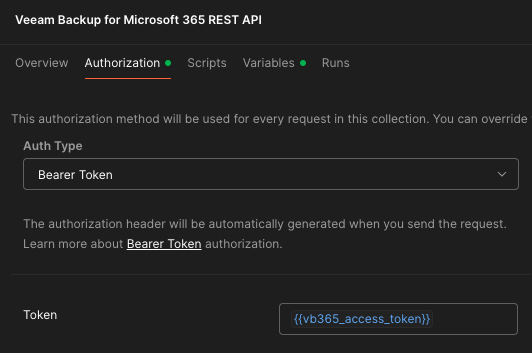

# Postman for Veeam Backup for Microsoft 365 (VB365)

[Postman](https://www.getpostman.com/) is a tool that’s build by developers for developers. It provides a complete API development environment with stream-lined collaboration to help any number of use cases including testing, development, & product development. They do have both [free and paid versions](https://www.getpostman.com/pricing) so if you are looking at getting started, they make it easy and you can work your way up.

## Requirements

* Veeam Backup for Microsoft 365
* [Postman](https://www.getpostman.com/)

## Getting Started

* Get the VB365 OpenAPI specification located in the [Veeam Help Center Documentation](https://helpcenter.veeam.com/references/vbo365/8/rest)

* Alternatively, you can find the specification on your local VB365 instance
  * To get this, you'll have to navigate to a URL hosted on your VB365 server
    * `https://<vb365_server>:4443/swagger/ui/index/index.html`

* Import the file we just downloaded into Postman

* Make sure `OpenAPI 3.0 Specification with a Postman Collection` is selected

* Click `Import`
  * **Wait...be patient!**

* Once imported, it will show up in your Postman Collections as shown below:

* Set the following [variables](https://learning.getpostman.com/docs/postman/environments_and_globals/variables/) in Postman:
  * `baseUrl`: Base URL of Veeam Backup for Office 365 RESTful API
    * _This can be configured while editing collection in a step below._
  * `vb365-username`: Username login
  * `vb365-password`: Password login

* Open the newly imported collection and navigate to the `v8` -> `token` -> `Request Authorization Tokens` API call
* Click on the `Authorization` tab
  * Set _Auth Type_ to `No Auth`

* Click on the `Body` tab
* Update fields as shown below:

* Click on the `Scripts` tab
* Copy/Paste the code from [here](automated_auth_test.js) in this section

* Click `Save` at the top-right
* Edit the collection settings by clicking on the root folder

* Navigate to the `Authorization` tab
* Choose _Type:_ `Bearer Token`
* Enter for _Token:_ `{{vb365_access_token}}`

At this point, you've now automated auth for **all** API calls! All you have to do when using an API call in this collection is make sure that `Authorization` is set to _Type:_ `Inherit auth from parent`

You can now begin using Postman with the Veeam Backup for Microsoft 365 API!
